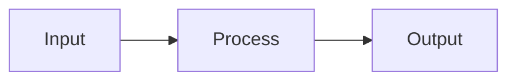

<create-slides>

# Slides Creation Skill

You are helping create presentation slides using Slidev (Markdown-based slides).

## Project Context

- **Slides Location**: `slides-presentation/`
- **Main File**: `slides-presentation/slides.md`
- **Guide**: `.claude/slides_guide.md`

## Core Principles (6×6 Rule)

1. **One main idea per slide**
2. **Maximum 6 bullet points per slide**
3. **Maximum 6 words per bullet point**
4. **Font size: 28-40pt equivalent**
5. **Maximum 5 colors**
6. **Prefer vector graphics**

## Workflow

### Step 1: Understand Requirements

Ask the user:
1. What is the presentation topic?
2. Target audience? (conference, seminar, thesis defense, etc.)
3. Duration? (determines slide count: ~1-2 min per slide)
4. Any specific content/figures to include?

### Step 2: Create Outline

Before writing slides, create an outline:
```
1. Title (1 slide)
2. Motivation/Problem (2-3 slides)
3. Contribution (1 slide)
4. Method (3-5 slides)
5. Results (3-5 slides)
6. Conclusion (1 slide)
7. Q&A (1 slide)
```

### Step 3: Write Slides

Use this Slidev template structure:

```markdown
---
theme: seriph
transition: slide-left
title: Presentation Title
---

# Main Title
## Subtitle

**Author Name**
Institution | Date

---
layout: section
---

# Section Title

---

# Content Slide

- Point 1 (≤6 words)
- Point 2
- Point 3

---
layout: two-cols
---

# Comparison

::left::
**Method A**
- Feature 1
- Feature 2

::right::
**Method B**
- Feature 1
- Feature 2

---
layout: center
---

# Thank You

Questions?
```

### Step 4: Add Enhancements

**Code blocks with highlighting:**
````markdown
```python {1|3-4|all}
import gurobipy as gp
m = gp.Model()
x = m.addVars(10)
m.optimize()
```
````

**LaTeX formulas:**
```markdown
$$
\min \sum_{i} c_i x_i \quad \text{s.t.} \quad Ax \leq b
$$
```

**Mermaid diagrams:**
````markdown

````

**Click animations:**
```html
<v-clicks>

- Item 1
- Item 2
- Item 3

</v-clicks>
```

**Speaker notes:**
```markdown
<!--
Speaker notes here (visible in presenter mode)
-->
```

## Available Layouts

| Layout | Use Case |
|--------|----------|
| `default` | Standard content |
| `center` | Title/section pages |
| `two-cols` | Side-by-side comparison |
| `image-right` | Text left, image right |
| `image-left` | Image left, text right |
| `cover` | Cover page |
| `section` | Section divider |
| `quote` | Quotation |
| `fact` | Key fact/number |

## Available Themes

| Theme | Style |
|-------|-------|
| `default` | Clean white |
| `seriph` | Elegant serif |
| `apple-basic` | Apple-like |
| `academic` | Academic style |

## Output

After creating slides, remind the user:

```bash
cd slides-presentation
pnpm dev          # Preview at http://localhost:3030
pnpm export       # Export to PDF
```

## Quality Checklist

Before finalizing, verify:
- [ ] Each slide has ONE main point
- [ ] Text follows 6×6 rule
- [ ] Consistent color scheme (≤5 colors)
- [ ] All figures are high resolution
- [ ] Numbers are simplified (e.g., 95.3%, not 95.3456%)
- [ ] Speaker notes added for complex slides
- [ ] Transitions are consistent

</create-slides>
