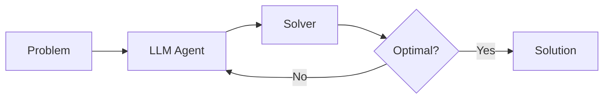
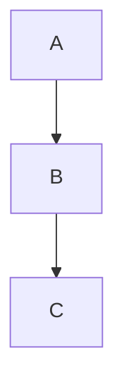

# Slides Best Practices Guide

> 综合 MIT Alumni Association PowerPoint 最佳实践 + Slidev 技术指南

## 核心原则

### 1. 从大纲开始

- 先用大纲规划主要观点和每页时间分配
- 幻灯片是**视觉概览**，帮助观众跟随思路
- 详细内容应由演讲者口头传达或在补充材料中提供
- Slidev: 使用 `---` 分隔的 Markdown 结构天然支持大纲思维

### 2. 内容精简法则 (6×6 Rule)

每张幻灯片应遵循：
- **1个主要观点** (One main idea)
- **最多6个要点** (Maximum 6 bullet points)
- **每点最多6个词** (Maximum 6 words per bullet)

### 3. 字体规范

| 类型 | 推荐 | 备选 |
|------|------|------|
| 无衬线 (主要) | Proxima Nova | Arial |
| 衬线 (正式) | Adobe Caslon Pro | Georgia |

**字号范围**: 28-40pt (确保可读性)

**避免**:
- ❌ 深色背景配浅色文字 (难以阅读)
- ❌ 过小字体 (< 24pt)

### 4. 颜色使用

- **不超过5种颜色** (除非用于分类/序列)
- 提前确定配色方案，全程一致
- 学术演示推荐：蓝色系 + 灰色系

**推荐学术配色**:
```
Primary Blue:   RGB(0, 98, 155)   #00629B
Secondary Gray: RGB(102, 102, 102) #666666
Accent Teal:    RGB(0, 156, 166)   #009CA6
Accent Gold:    RGB(203, 160, 82)  #CBA052
```

### 5. 图片与图形

- **谨慎使用图片** - 留出更多空间给内容
- **避免动态 GIF** - 分散注意力
- 保持一致性：大小、分辨率、位置
- **优先使用矢量图** - 放大不失真
- 注意文件大小，影响邮件发送

### 6. 数字与图表简化

| 原始 | 简化 |
|------|------|
| $4,036.65 | $4,000 或 $4K |
| 87.3456% | 87% |
| 1,234,567 | 1.2M |

图表标签：空间不足时，隔列标注

### 7. 文字精简

| 冗长表达 | 简洁替换 |
|----------|----------|
| due to the fact that | because |
| in the event that | if |
| it is necessary that | must |
| prior to | before |
| subsequent to | after |
| with regard to | about |
| is able to | can |
| it is possible that | may |

---

## Slidev 技术规范

### 文件位置

```
slides-presentation/
├── slides.md           # 主幻灯片 (Markdown)
├── components/         # 自定义 Vue 组件
├── pages/              # 多文件幻灯片
├── snippets/           # 代码片段
└── public/             # 静态资源 (图片等)
```

### Frontmatter 配置

```yaml
---
theme: seriph              # 主题
transition: slide-left     # 过渡效果
layout: center             # 布局
class: text-center         # CSS 类
---
```

**常用主题**:
| 主题 | 风格 | 场景 |
|------|------|------|
| `default` | 简洁白色 | 通用 |
| `seriph` | 优雅衬线 | 学术 |
| `academic` | 学术风格 | 论文答辩 |

**常用布局**:
| 布局 | 用途 |
|------|------|
| `default` | 标准内容页 |
| `center` | 居中标题页 |
| `two-cols` | 双栏对比 |
| `image-right` | 左文右图 |
| `image-left` | 左图右文 |
| `cover` | 封面页 |
| `section` | 章节分隔页 |

### 点击动画

```html
<!-- 逐步显示 -->
<div v-click>第一次点击显示</div>
<div v-click>第二次点击显示</div>

<!-- 指定顺序 -->
<div v-click="3">第三次点击</div>

<!-- 区块包裹 -->
<v-clicks>
- 项目1
- 项目2
- 项目3
</v-clicks>
```

### 代码高亮

````markdown
```python {1|3-4|all}
import gurobipy as gp      # 第一步高亮
m = gp.Model()
x = m.addVars(10)          # 第二步高亮
m.optimize()
```
````

行号语法：`{1|3-4|all}` = 依次高亮第1行 → 3-4行 → 全部

### LaTeX 公式

```markdown
行内公式: $\sum_{i=1}^n c_i x_i$

块级公式:
$$
\min \sum_{i \in I} c_i x_i \quad \text{s.t.} \quad Ax \leq b
$$
```

### Mermaid 图表

````markdown

````

### 演讲者备注

```markdown
---

# 幻灯片标题

内容...

<!--
演讲者备注 (仅在 Presenter 模式可见)
- 要点提醒
- 时间控制
-->
```

访问 `http://localhost:3030/presenter` 查看

---

## 学术演示结构模板

### 研究汇报 (15-20分钟)

```
1. Title Slide (1张)
   - 标题、作者、机构、日期

2. Motivation (2-3张)
   - 问题背景
   - 为什么重要
   - 现有方法的局限

3. Contribution (1张)
   - 本工作的核心贡献 (3-4点)

4. Method (3-5张)
   - 方法框架图
   - 关键技术细节
   - 算法/公式

5. Experiments (3-5张)
   - 实验设置
   - 主要结果表格
   - 对比分析图

6. Conclusion (1张)
   - 总结贡献
   - 未来工作

7. Thank You / Q&A (1张)
```

### OR/ML 论文答辩模板

```markdown
---
theme: academic
transition: fade
---

# Paper Title
## Subtitle if needed

**Author Name**
Institution

Date

---
layout: section
---

# Motivation

---

# Problem Statement

- Current challenge: ...
- Gap in existing work: ...
- Our approach: ...

---
layout: two-cols
---

# Method Overview

::left::
**Key Components**
1. Component A
2. Component B
3. Component C

::right::


---

# Experimental Results

| Method | Metric 1 | Metric 2 |
|--------|----------|----------|
| Baseline | 80.2% | 3.5 |
| **Ours** | **95.3%** | **2.2** |

---
layout: center
---

# Thank You

Questions?
```

---

## 命令速查

```bash
cd slides-presentation

# 开发预览
pnpm dev

# 导出 PDF
pnpm export

# 导出指定格式
pnpm export --format pptx
pnpm export --format png

# 构建静态网站
pnpm build
```

**快捷键**:
| 键 | 功能 |
|-----|------|
| `Space` / `→` | 下一页 |
| `←` | 上一页 |
| `o` | 概览模式 |
| `d` | 暗色切换 |
| `f` | 全屏 |
| `g` | 跳转页码 |

---

## Checklist: 演示前检查

- [ ] 每页只有一个主要观点
- [ ] 文字不超过 6×6 规则
- [ ] 字体大小 ≥ 28pt
- [ ] 颜色不超过 5 种
- [ ] 图片清晰度足够
- [ ] 数字已简化
- [ ] 测试过实际投影效果
- [ ] 演讲者备注已添加
- [ ] 导出 PDF 备份

---

*参考来源: MIT Alumni Association PowerPoint Best Practices*
